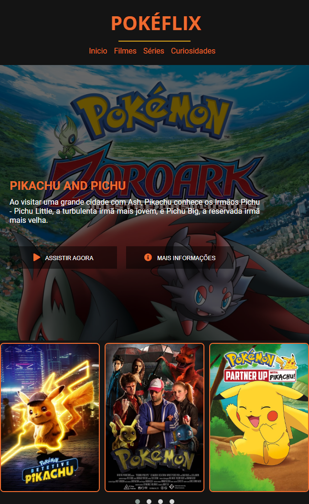

  

## 🚀 Tecnologias

Esse projeto foi desenvolvido com as seguintes tecnologias:

- HTML
- CSS
- JQuery
- Carrinho

## 💻 Projeto

Apreendi muitas coisas na criação desse projeto como usar as variaveis para aplicar as cores padrão e já estou aplicando em um projeto de comunidade que participo e até repassei a ideia para os outros membros, também foi ótimo ver como o Instrutor Felipe Aguiar @felipeAguiarCode, passa as dicas de procurar as imagens do NEtflix no google e assim poder ter uma visão mais clara do que esta construindo, essa dica é otima para quem não é design e quer continuar treinando a criação de interfaces.

O Pokéflix se originou do desafio Recriando a Interface da Netflix da DIO, no meu projeto eu segui as aulas do desafio mas recriando o projeto com algumas mudanças na estrutura interna do HTML e já aplicando as imagens e cores que achei interessante. Fiz o link de alguns vídeos do Youtube para as imagens do Carrossel para ter algo em que clicar, mas o meu objetivo é usar esse projeto como partida para ser refatorado aplicando as próximas tecnologias _React e React Native_
