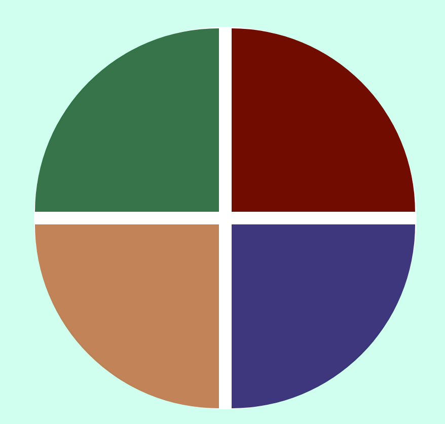

  

## 🚀 Tecnologias

Esse projeto foi desenvolvido com as seguintes tecnologias:

- HTML
- CSS
- JavaScript

## 💻 Projeto

Esse projeto me ajudou a compreender um pouco mais como posso manipular os elementos do DOM através do Javascript, reforçou o uso do _FOR_ e dos ARRAYS.

Assim como me fez compreender o quanto é últil saber usar o GRID do CSS, nesse jogo foi aplicado o Display: GRID e usado o GRID-TEMPLATE-AREAS, para organizar todo o layout do jogo.

Alterações:
Somente fiz alterações nas cores usadas por tons mais escutos.

Para o futuro:
Prentendo refazer o jogo melhorando seu layout e incrementando a sua logica e quem sabe ir além e fazer uma versão mobile.
