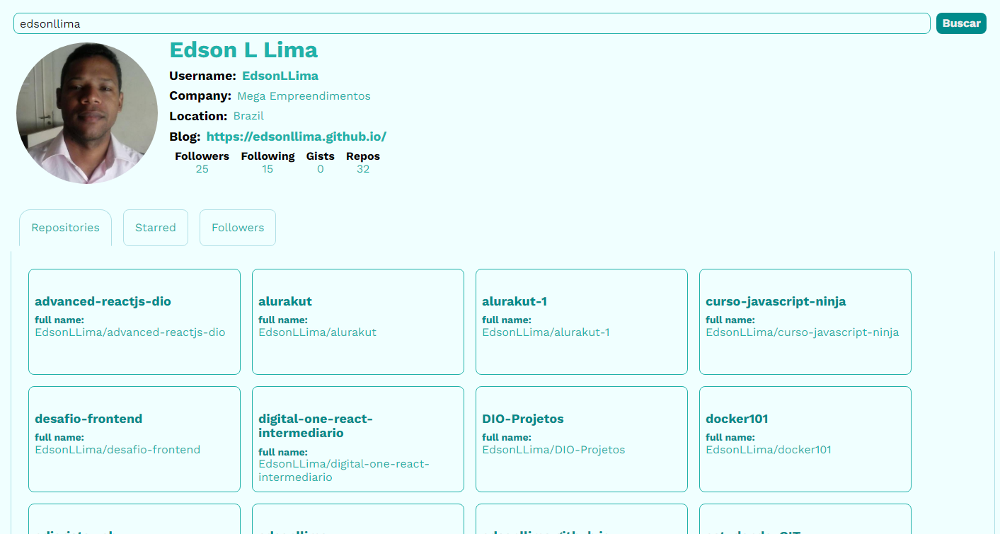

<p align="center">
  
</p>


# Github App
Consumir api GitHub para buscar seus usuários, trazendo seus repositórios e repositorios favoritados

## Alterações

Montei minha versão do App da aula seguindo passo a passo a aula e tentando entender sua logica. Durante a aula eu mudei um pouco o layout(cores e botões), adicionai mais uma tab ao projeto para que possa ser exibido todas os users que seguem aquele repositorio pesquisado.


 ### link da API Github
    - user:
         https://api.github.com/users/nameuser
    - repositories:
         https://api.github.com/users/nameuser/repos
    - starred:
         https://api.github.com/users/nameuser/starred
    - followers:
         https://api.github.com/users/nameuser/followers


Graças ao curso eu apreendi a consumir uma API, antes tinha muitas dúvidas de como se faz o consumo de uma API, como eu faria para fazer cada campo ficar dinâmico trazendo as informações de outro local.

Também entendi muita mais o uso do CSS dentro do React que era outra dúvida que tinha de como fazer estilizações nos componentes e com as aulas não só entendi muito mais como fiz varias alterações que partiram de mim.

Entendi um pouco mais sobre componentes com as aulas, pois comecei a ver como o Instrutor tratava os componentes.

Confesso que na lógica em algumas partes eu me perdi e precisava refazer as aulas para entender, e outras logicas usadas em aula não entendi por completo, mas sei que isso também é por que anda estou começando e sei que no futuro não só entenderei como criarei minha própria logica.
´´´´´´´´´´´´´´´´´´´´´´´´´´´´´´´´´´´´´´´´´´´´´´´´´´´´´´


# Install

Clone this repository and install it dependencies with this command:

```sh
$ npm install
```

# Running

Run the application with `npm start` command, it will start the app on [localhost:3000](http://localhost:3000):

```sh
$ npm start
```

# License

This project is licensed under the MIT License - see the [LICENSE.md](LICENSE.md) file for details
