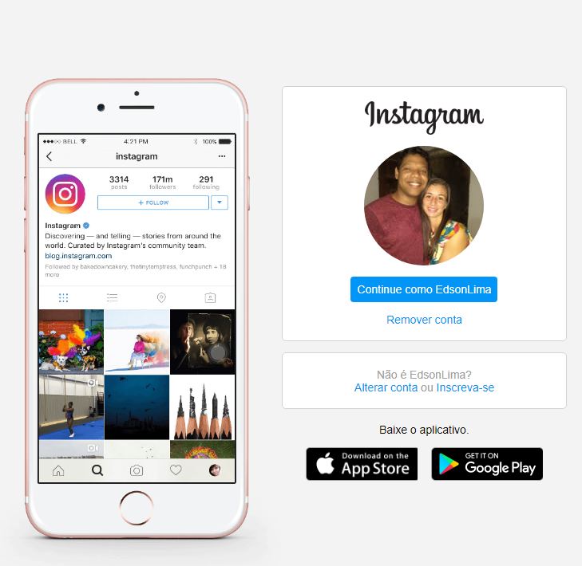

# Project Instagram Home DIO

  

## O objetivo do projeto é replicar o layout da página inicial do instagram e estilizar usando o Flexbox

### Com esse projeto reforcei:

- Os conhecimentos em Flexbox.
- Os conhecimento no uso do @media para resposividade
- Os conhecimentos de várias propriedades do flex container e os flex items.
